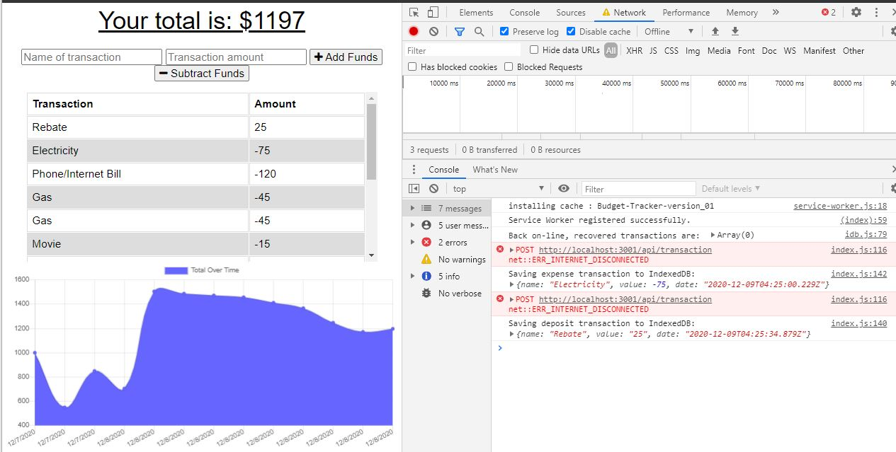
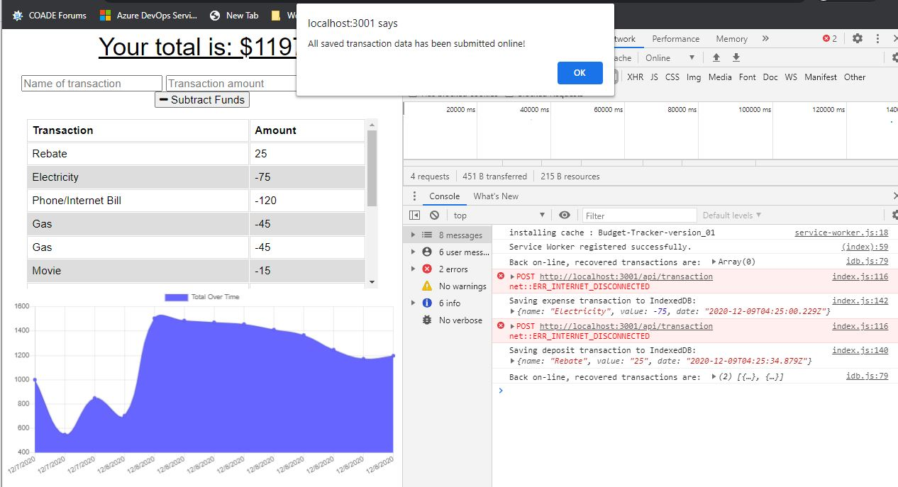

# Budget Tracker - A Progressive Web Application
(Richard Ay - December 2020)

## Table of Contents
* [Project Objective](#project-objective)
* [Acceptance Criteria](#acceptance-criteria)
* [Technologies Used](#technologies-used)
* [Deployment Link](#deployment-link)
* [Application Screen Shot](#application-screen-shot)

## Project Objective
As an avid traveler I want to be able to track my withdrawals and deposits with or without a data/internet connection
so that my account balance is accurate when I am traveling. 

## Acceptance Criteria
Given a budget tracker application without an internet connection,

* When the user inputs an expense or deposit, then they will receive a notification that they have added an expense or deposit.

* When the user reestablishes an internet connection, then the deposits or expenses added while they were offline are added to their transaction history and their totals are updated.

## Technologies Used

* IndexedDB for offline functionality and persistence
* Service Workers
* Express.js
* MongoDB for database functionality
* Heroku for deployment

## Deployment Link
The deployment link to display the updated web page is: 
[GitHub Pages](https://captainrich.github.io/budget-tracker/) 

## Application Screen Shot

 The first image shows two transactions (a deposit and an expense) being saved to browser storage (IndexedDB) in off-line mode.

 The second image shows the response (alert) when the system goes back on-line, reporting that the transactions have been saved on-line.

 The third image shows the expansion of the console.log data, revealing both transactions were recovered and saved.